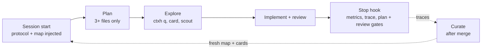

# ctx-harness

A Claude Code plugin that gives coding agents compact, automatically maintained repository context, so they spend fewer tokens rediscovering the same code on every task.

Three properties:

- **Automatic.** Agents build the context and keep it fresh through hooks. Nobody writes docs by hand.
- **Repository-agnostic.** It works from signals every repo has: manifests, CI files, imports and git history. It doesn't depend on existing documentation.
- **Cheaper than a plain session.** A small map is always loaded and everything else is pulled on demand through a zero-token index. Every session records its token usage, so you can measure the saving against a run with the harness off.

## Install

```text
/plugin marketplace add ahmetask/ctx-harness
/plugin install ctx-harness@ctx-harness
```

Then, in a repository:

```text
/ctx-harness:build
```

To have teammates prompted to install it when they open a repo, add this to the repo's `.claude/settings.json`:

```json
{
  "extraKnownMarketplaces": {
    "ctx-harness": { "source": { "source": "github", "repo": "ahmetask/ctx-harness" } }
  },
  "enabledPlugins": { "ctx-harness@ctx-harness": true },
  "permissions": { "allow": ["Bash(ctxh *)"] }
}
```

The `permissions` entry lets agents query the index without an approval prompt each time.

Requirements: Claude Code, git, and Python 3.10+ on macOS or Linux. The engine uses only the Python standard library.

## What you get

| Piece | Name | Role |
|---|---|---|
| Coder | your main session | The only agent that edits files. Follows `protocol.md`, which a hook injects at session start |
| Scout | `ctx-harness:scout` (Haiku) | Read-only lookups that return a few lines with `file:line`, so the coder's context stays clean |
| Planner | `ctx-harness:planner` | For changes touching 3+ files: writes `.ctx/tasks/active.md` (goal, scope, acceptance criteria, risks, steps). The coder waits for your approval |
| Reviewer | `ctx-harness:reviewer` | Reviews the diff with a fresh context, never the coder's reasoning. Also reports context the change made outdated |
| Card-writer | `ctx-harness:card-writer` (Haiku) | Writes one module card, used by build and curate |
| Build | `/ctx-harness:build` | Bootstraps `.ctx/` from zero |
| Curate | `/ctx-harness:curate` | After merges: refreshes stale cards and promotes recurring facts from task traces |
| Status | `/ctx-harness:status` | Shows freshness, budget checks and token stats |
| Engine | `ctxh` | Deterministic index, queries, freshness checks and metrics. On the agents' `PATH` |

The coder is your normal session rather than a subagent, because the agent that writes code should hold your whole conversation. Helpers work in isolated contexts and hand back short answers.

## How it works



Step-by-step sequence diagrams are in [docs/flow.md](docs/flow.md).

**Hooks** (they run automatically, and only in repos that have `.ctx/`):

- **SessionStart:** injects the protocol and `.ctx/map.md` (a few hundred tokens), lists stale cards, points to an active plan, and re-indexes in the background if code changed since the last index.
- **UserPromptSubmit:** a one-line reminder of the two rules agents skip most often: plan for 3+ files, and review before finishing.
- **Stop:** records tokens, steps, files read and edited, failed commands and empty index queries. If code changed since the last reviewer run, it blocks finishing once and asks for a review. It blocks only once per edit, so it can't loop.

In a repo without `.ctx/`, the hooks print a one-line hint and write nothing.

**The repo's `.ctx/` folder:**

```
.ctx/
  map.md            always loaded; under 60 lines
  cards/<module>.md loaded on demand; each card is anchored to its source files by hash
  learned.md        facts promoted from real task traces
  commands.json     detected and verified build/lint/test commands
  tasks/            active plan, coder notes, done/ archive
  protocol.md       optional: overrides the plugin's default protocol for this repo
  graph.json        index (gitignored, rebuilt automatically)
  tmp/ traces/ metrics/   per-machine (gitignored)
```

Commit `.ctx/`; its own `.gitignore` keeps the derived and per-machine files out.

## The engine

```bash
ctxh q hot                       # most central files (PageRank over imports)
ctxh q find OrderService         # symbol -> file:line
ctxh q impact app/payments/client.py
ctxh q cochange client.py        # files that change with it in git history
ctxh q risk client.py            # fix/revert commits touching it
ctxh q tests repo.py
ctxh stale                       # cards whose source files changed
ctxh check                       # budgets, dead paths, unstamped anchors, instruction-like phrasing
ctxh stats                       # harness vs baseline token medians and break-even
ctxh add-command test "<cmd>" [--replaces "<detected cmd>"]   # keep a fixed or added command
```

Imports and symbols are parsed with regexes for Python, JS/TS, Go (including nested modules), Java/Kotlin, Rust, Ruby and shell. Extensionless scripts are indexed by their shebang (`python`, `node`, `ruby`, `bash`/`sh`). Modules are grouped by folder.

**What gets indexed.** Every file git tracks, except dependency and build folders, `testdata/`, and paths matched by a `.ctxignore` at the repo root. It uses gitignore syntax and keeps fixtures, vendored samples and test data out of the index and command detection:

```gitignore
bench/demo/template/
fixtures/
*_gen.py
```

**Commands.** `build-index` proposes build, lint and test commands from Makefiles, manifests and CI `run:` steps (installs, deploys and steps with `${{ }}` expressions are skipped). `--verify` runs them. When an agent fixes or adds one with `ctxh add-command`, it is stored as `source: manual`, survives re-index and is re-run by `--verify`. `--replaces` retires the detected command it fixes.

## Measuring against a baseline

`bench/` holds a benchmark platform: a demo Go repo with scripted git history, 6 tasks with hidden acceptance tests, and a runner that compares harness and baseline sessions on tokens and pass rate. See [bench/README.md](bench/README.md).

```bash
python3 bench/run.py --agent fake                   # offline smoke run of the platform
python3 bench/run.py --agent claude --repeats 3     # real harness-vs-baseline runs
```

To measure on your own repo and tasks instead:

```bash
CTXH_TASK=t1 claude -p "<task>"                     # harness run
git stash -u
CTXH_TASK=t1 CTXH_DISABLED=1 claude -p "<task>"     # same task, harness off
ctxh stats
```

Sessions labeled `bootstrap` or `curate` count as overhead, and `stats` amortizes them into a break-even estimate. Run several tasks, a few times each; single runs are noisy.

All of this is read out of Claude Code's transcript JSONL, so a format change could zero the numbers and switch the review gate off without anyone noticing. Checked-in fixtures in [tests/fixtures/transcripts](tests/fixtures/transcripts) pin the parse, and when a real transcript yields no `usage` or no tool name the engine knows, `ctxh usage` fails with the reason and the Stop hook warns once on stderr instead of recording a row of zeros.

## Automating curation

Curation should follow merges, not run during a task. Options:

- run `/ctx-harness:curate` yourself after merging (the coder reminds you when cards are stale)
- a CI job on the default branch that installs the plugin and runs `claude -p "/ctx-harness:curate"`, then commits `.ctx/`

## Environment variables

| Variable | Effect |
|---|---|
| `CTXH_DISABLED=1` | Harness off for the session: nothing is injected, and the run is recorded as `baseline` |
| `CTXH_TASK=<name>` | Labels the session's metrics for paired comparisons |
| `CTXH_REVIEW_GATE=0` | Turns off the Stop-hook review check |
| `CTXH_PLAN_GATE=0` | Turns off the Stop-hook check that a 3+ file change was planned |

## Development

```bash
python3 -m unittest discover -s tests      # engine and benchmark tests (benchmark ones need Go)
claude plugin validate .                   # marketplace manifest
claude plugin validate ./plugins/ctx-harness
claude --plugin-dir ./plugins/ctx-harness  # try local changes without installing
```

## Limits

- **Parsing:** import and symbol parsing is regex-based. Tree-sitter would make it more precise.
- **Token accounting:** reads Claude Code's transcript format, which can change between versions. Fixtures pin the current shape and a drift warns, but refreshing them is manual.
- **Local traces:** traces stay on each machine. For team-wide curation, ship them to a shared store, such as Redis, and point the curator there.
- **Gates fire at the end:** both the plan and review checks run in the Stop hook, so they catch an unplanned or unreviewed change when the session tries to finish rather than when it starts. A PreToolUse gate would interrupt mid-change; this costs a turn instead.
