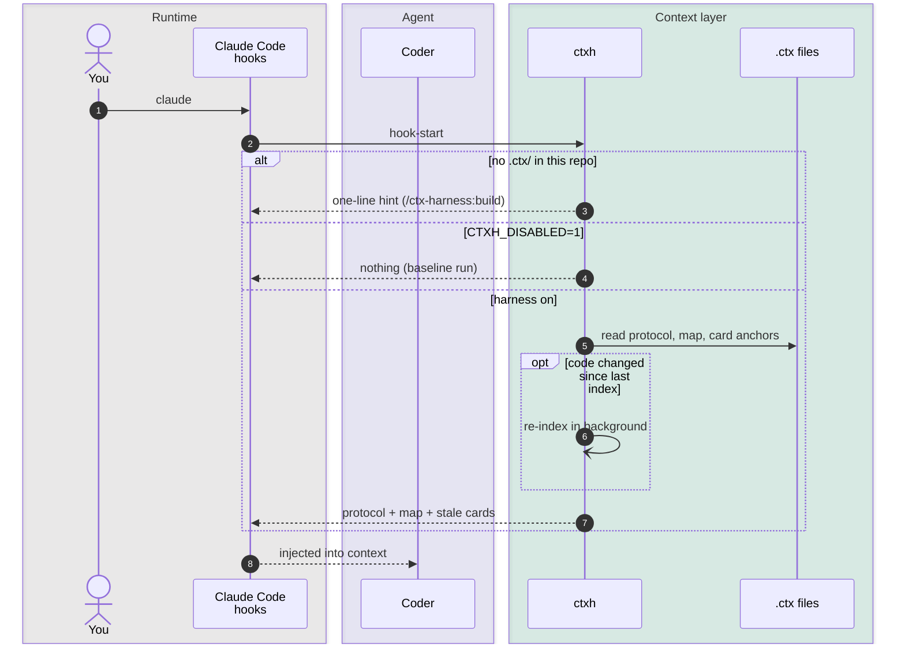
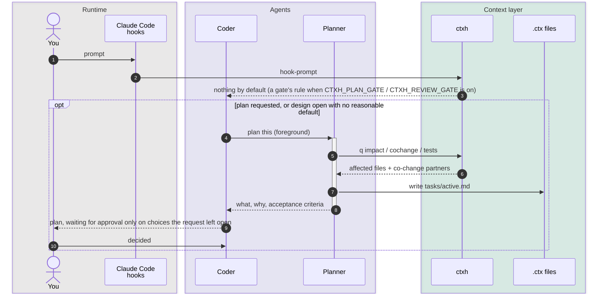
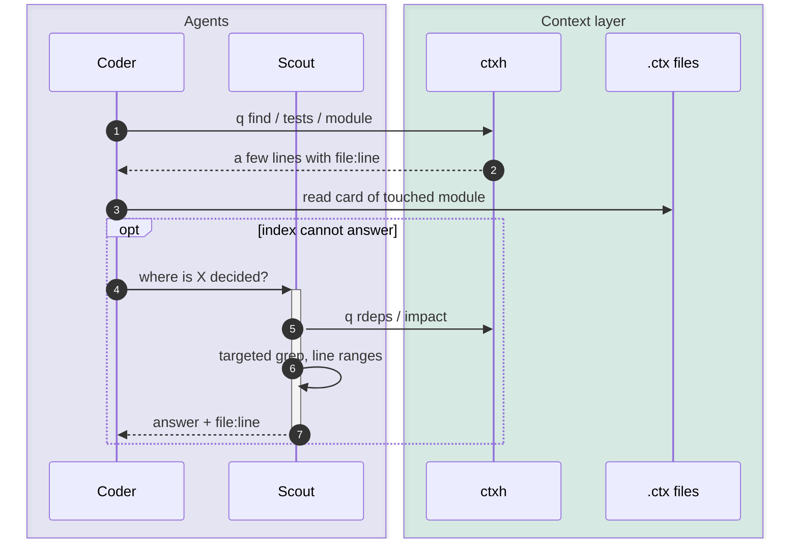
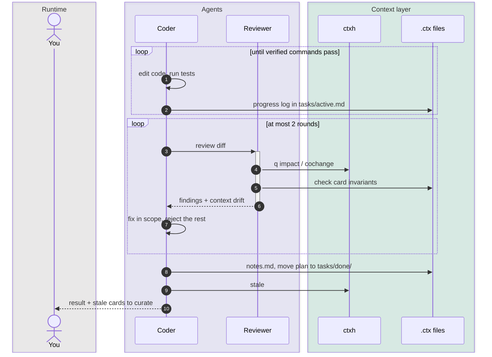
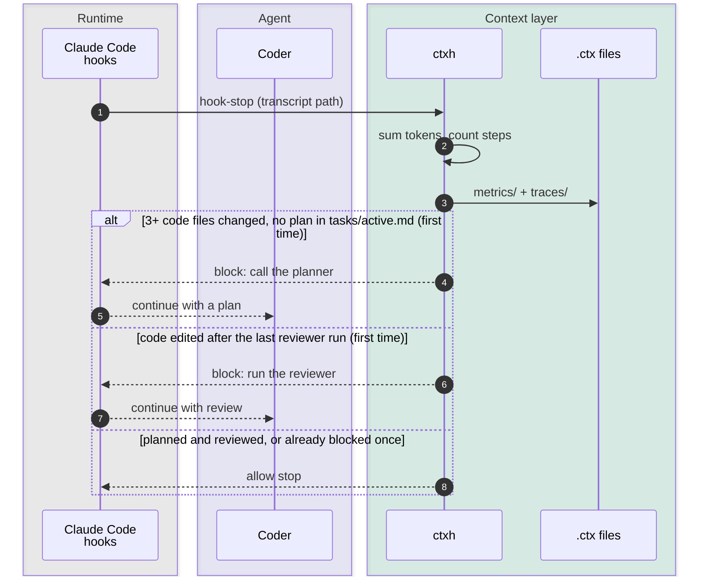
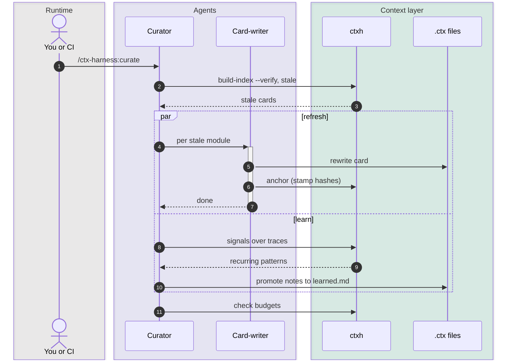

# Flow, phase by phase

Lane colors: gray is the runtime, purple is agents (they spend LLM tokens), and teal is the context layer (zero LLM tokens).

## 1. Session start

Context loads before the first prompt.

## 2. Prompt and plan

By default the prompt hook adds nothing and the coder starts working; the plan step is for a user-requested plan or a design with no reasonable default, and `CTXH_PLAN_GATE=1` makes it a rule for 3+ file changes.

## 3. Explore

The cheapest source is tried first. This is where the token saving comes from.

## 4. Implement and review

The coder implements alone by default. The review below runs when you ask for it, when a change touches 6+ files or a fragile file, or when `CTXH_REVIEW_GATE=1` makes it a rule. The reviewer gets a fresh context.

## 5. Stop hook

The Stop hook runs after every turn. It handles measurement plus two opt-in, one-time gates (`CTXH_PLAN_GATE=1`, `CTXH_REVIEW_GATE=1`): a plan gate for changes that spread over 3+ code files, then the review gate. Each blocks at most once per state, so neither can loop.

## 6. Curation

Curation runs after merges. You can trigger it manually, from CI, or on a schedule.

In step 6, the Curator is the main session running the curate skill. It is not a separate agent.
